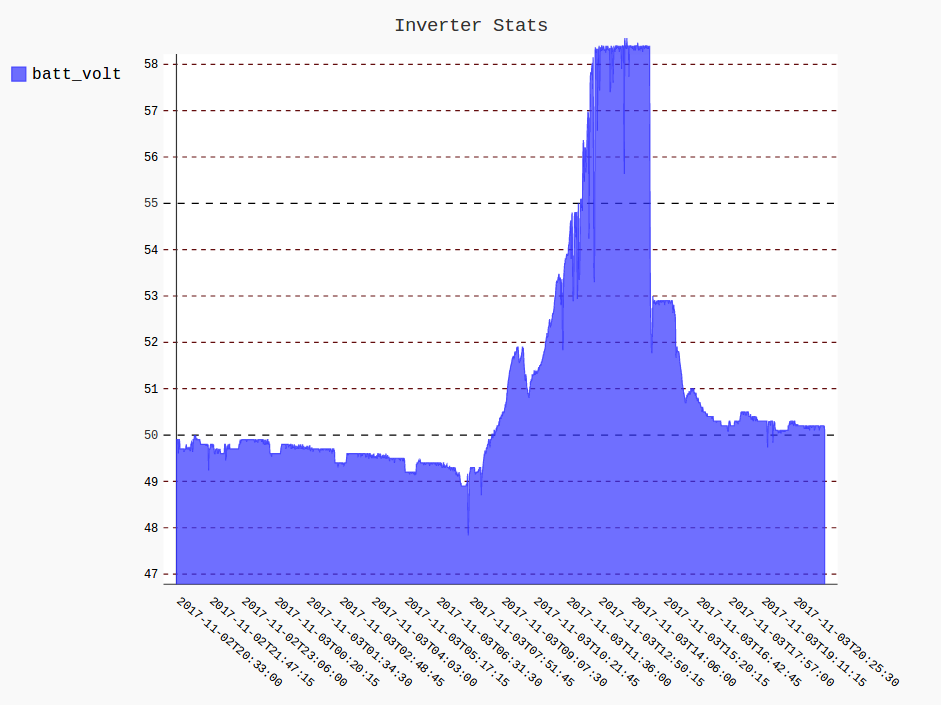
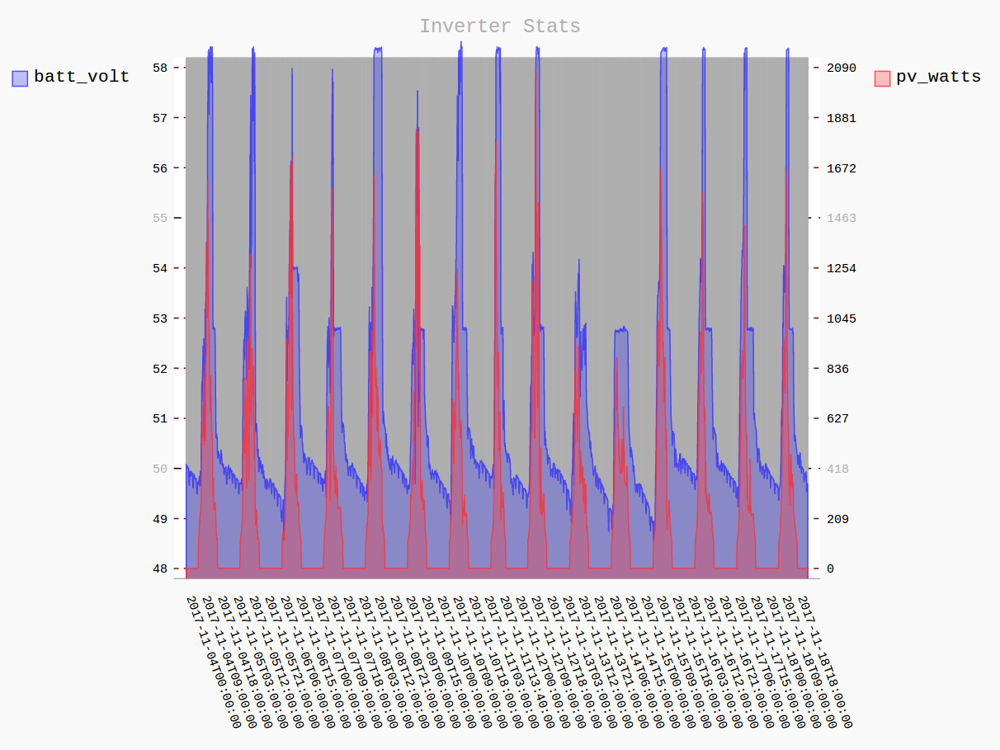

# godenerg
Atersa / Axpert Inverter python library / interface / tool

So far tested on usb connections, whenever I get my hands on a usb to serial adapter
I will test on serial connections.

## Testing:
```
 $> pytest -v --pyargs axpert
```

## Run as daemon

```
 $> python3 axpert/main.py --usb -d /dev/hidraw0 --deamon
```

* Datalogger starts up and starts logging QPIGS command into a sqlite 
  database. The loggin interval is configured via the setup file found 
  in the file [axpert/settings.py](axpert/settings.py) inside the 
  dictionary `datalogger_conf`:

  ```python
    datalogger_conf = {
        'db_filename': '/home/ups/godenerg/godenerg.db',
        'interval': 15,
        'port': 8890
    }
    ```

    - *Next Steps for datalogger*  
      From here, the next step will be to start logging the last 5 hours, just keeping 
      the 5 previous hours logged by a small interval (like each 2 seconds).
      With this data I can then develop processes to overwrite the 
      dodgy charging algorithims that the inverted has and some other 
      little problems, changing settings on the fly dinamicaly.

* Datalogger HTTP server for graphing datacharts (for the moment).
  The server starts in the port specified under the 'port' key in 
  the `datalogger_conf` specified above.

    - Charting of one or two metrics are allowed.

    - If more of 2048 points are present in the chart averaging is done
      dinamicaly.

    - Date or datetime ranges are possible with the following querystring parameter
      formats, you can specify YYYYMMDD/YYYYMMDDHH/YYYYMMDDHHMM/YYYYMMDDHHMMSS:

        * From 2017-11-01 00:00 to 2017-11-04 00:00
        ```
        from=20171101&to=20171104 
        ```

        * From 2017-11-02 15:57 to 2017-11-02 19:00
        ```
        from=201711021557&to=2017110219
        ``` 

    - First desired column format: `col_1=bat_volt`

    - Second desired column format (optional): `col_2=pv_watts`
    
    - Example 1, graphing `batt_volt` for third of November:

       `http://machine_ip:8890/graph?from=20171103&to=20171104&col_1=batt_volt`
        

    - Example 2, graphing `batt_charge_amps` vs `pv_amps` for the third of November:
    
        `http://machine_ip:8890/graph?from=20171103&to=20171104&col_1=batt_charge_amps&col_2=pv_amps`
        

    - Available values are:
        * `grid_volt` 
        * `grid_freq `
        * `ac_volt`
        * `ac_freq`
        * `ac_va`
        * `ac_watt`
        * `load_percent`
        * `bus_volt`
        * `batt_volt`
        * `batt_charge_amps`
        * `batt_capacity`
        * `temp`
        * `pv_amps`
        * `pv_volts`
        * `batt_volt_scc`
        * `batt_discharge_amps`
        * `pv_watts`


* HTTP Server for JSON realtime data usage. Since the nature of the
  USB / serial communications is limited to a single client. Calls
  block until the serial / USB is free. So far just status (QPIGS)
  and (QMOD) commands are implemented. Adding other query commands
  or set commands will come soon since is just a matter of defining
  the specifications to a descriptive structure already defined.


    - Status(QPIGS) as JSON:
    ```
    http://machine_ip:8889/cmds?cmd=status
    ```

    - Operation Mode (QMOD) as JSON:
    ```
    http://machine_ip:8889/cmds?cmd=operation_mode
    ```

    - Both comibined as JSON (indexed in 2 different keys)

    ```
    http://machine_ip:8889/cmds?cmd=operation_mode&cmd=status
    ```

    - Both combined as JSON in a single with all key/values merged
    ```
    http://machine_ip:8889/cmds?cmd=operation_mode&cmd=status&merge=1
    ```


## Run as command line tool

 ### Get current status values (QPIGS command)
 ```
 > python3 axpert/main.py --usb -d /dev/hidraw0 --status

 (000.0 00.0 230.0 50.0 0322 0221 006 425 52.80 011 100 0040 0016 100.6 52.78 00000 01110110 00 00 00844 010
 ```

 ### Get current status values as JSON

 ```
 > python3 axpert/main.py --usb -d /dev/hidraw0 --status --json

    {"ssc_firmware_updated": false, "grid_volt": 0.0, "raw_status": "01010000", "batt_volt": 49.7, "ac_volt": 229.9, "batt_capacity": 75, "configuration_changed": true, "pv_amps": 0, "bus_volt": 400.0, "ac_freq": 50.0, "ac_va": 298, "mask_d": 10, "batt_charge_amps": 0, "batt_volt_scc": 0.0, "load_status": true, "sbu_priority_version": false, "pv_volts": 0.0, "temp": 45, "load_percent": 6.0, "charge_source": ["not_charging"], "batt_discharge_amps": 5, "pv_watts": 0, "batt_volt_to_steady": false, "mask_c": 0, "grid_freq": 0.0, "mask_b": 0, "ac_watt": 241}
 ```

 ### Get operation mode (QMOD command):

```
 > python3 axpert/main.py --usb -d /dev/hidraw0 --op-mode

```

 ### Get operation mode as json:

```
 > python3 axpert/main.py --usb -d /dev/hidraw0 --op-mode --json

    {"mode": "BT"}
```

 ### Change Float Voltage to 53.0 V

 ```
 > python3 axpert/main.py --usb -d /dev/hidraw0 --cmd PBFT -v 53.0  -s 8
 (ACK
 ```

 ### Change Utility MAX charge current to 10 amps for first paralel device

 ```
 > python3 axpert/main.py --usb -d /dev/hidraw0 --cmd MCHGC -v 010 -s 8 
 (ACK
 ```

 ### Extract data from datalogger

 ```
 > python3 axpert/main.py --usb -d /dev/hidraw0 --extract-csv-data 20171031000000-20171031235959 --col datetime --col batt_volt --col batt_charge_amps --extract-file stats.csv
 ```


